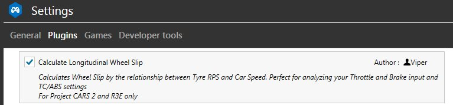
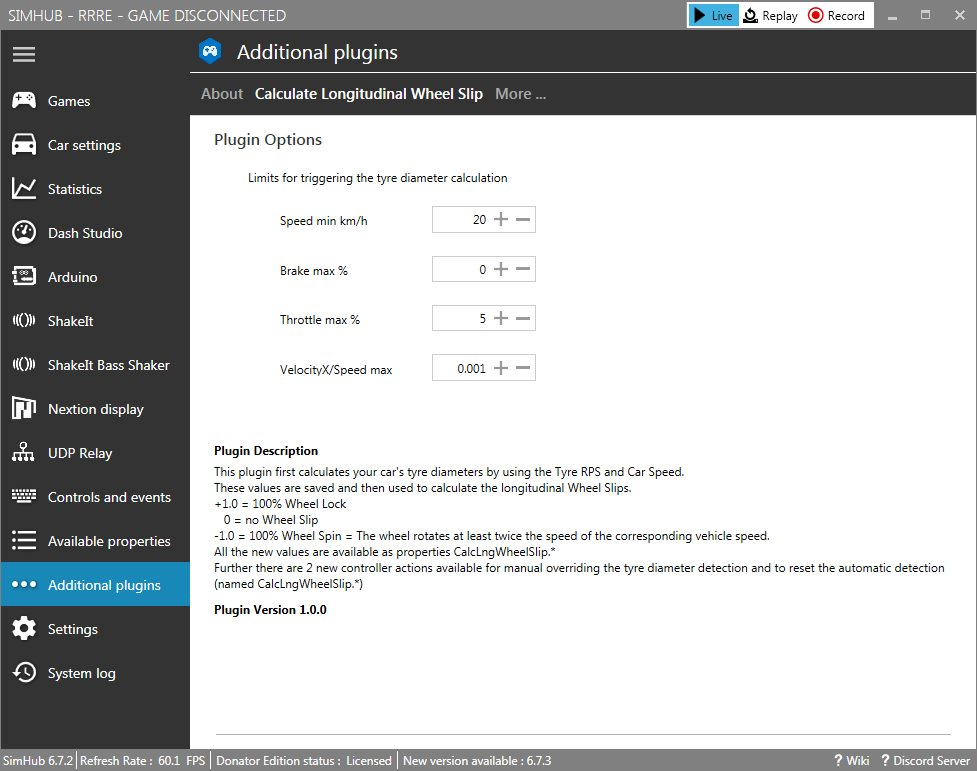
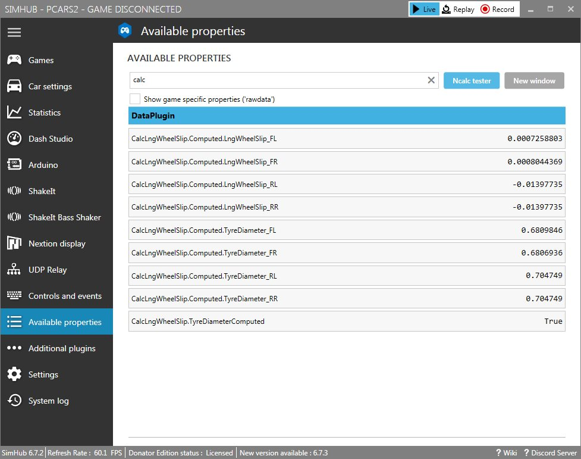
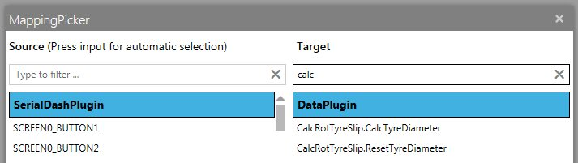
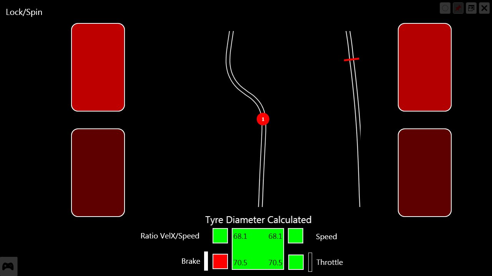
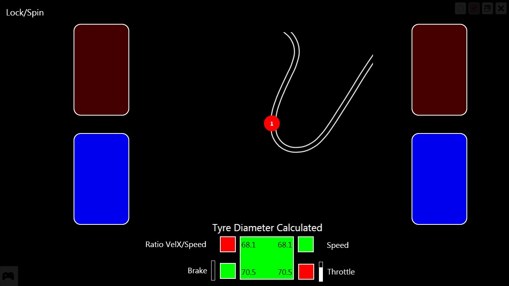
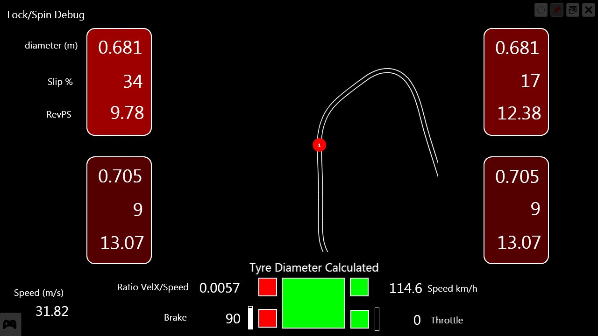

# SimHub-Plugin: Calculate Longitudinal Wheel Slip
This is a plugin for [SimHub](http://www.simhubdash.com/)

It calculates wheel slip by the relationship between Tyre RPS and Car Speed and provides the result as new properties.\
It is working for **Project CARS2** and **Race Room Racing Experience only**.

## Installation
Put the DLL file Viper.PluginCalcLngWheelSlip.dll into the SimHub folder parallel to the SimHubWPF.exe and start SimHub.\
SimHub detects the new plugin, confirm the question for enabling.\
If SimHub does not start, please check the log files in the "Logs" folder.
If you go to Settings -> Plugins tab now you should see the new plugin.

Further there is a settings screen under "Additional Plugins"-> "Calculate Longitudinal Wheel Slip" where you can configure the limits when a tyre diameter calculation is triggered.

### Why do we need a tyre diameter calculation and what about these limits?
For the wheel slip calculation we have to calculate the tyre surface speed and compare it to the car speed.\
And for the tyre surface speed calculation we need the tyre diameter, which is not available in the game API.\
That means we have to calculate it first, but this works only if the wheel slip is nearly zero (no locking/spinning wheels, no cornering, no side slip).\
To automatically detect such a moment I defined 4 limits:
- minimum Car Speed - The higher the speed, the more accurate the result (default: 20 km/h)
- maximum Brake input - prevent wheel locking (default: 0%)
- maximum Throttle input - prevent wheel spinning (default: 5%)
- maximum ratio value between lateral car speed (sideways) and car speed - prevent cornering and side slides (default: 0.001)

As soon as all 4 limits are met for the first time, the tyre diameter is calculated.\
And only when the diameter is calculated, the slip can be calculated.\
The tighter the limits are set, the more accurate the result, but the longer it takes that this moment happens.

### How to use the plugin
The plugin provides new properties and actions.\
The new properties provide the calculated diameter(m) and the longitudinal slip value of every wheel.\
The slip value can be understood as follows:
-  0 = no slip, the tyre surface speed is the same as the car speed
-  1.0 = 100% wheel lock, the tyre surface speed is 0 and the car still moving
- -1.0 = 100% wheel spin, the tyre surface speed is twice that of the car speed. The value can be lower than -1.0.

There are further two new actions:
- CalcTyreDiameter - manual trigger the tyre diameter calculation, the detection limits are ignored
- ResetTyreDiameter - reset the tyre diameter, the automatic detection begins again

### Demo Dash
For illustration purposes I added a Demo Dash to the Release.\
Simple double click on the file "Lock and Spin of Wheels.simhubdash" and SimHub will ask for the import process.\
The Dash has two screens, a main screen and a debug screen, which has some more information.\
You can see the the 4 wheels and they will change the color depending on the calculated spin (blue) and lock (red) value.\
At the bottom you can see how the tyre diameter detection works. There are 4 small squares showing the 4 limits, green = within the limit, red = outside the limit (The limit values were taken over manually from the plugin. If you change them in the plugin, you have to change it in the Dash, too.). At the first moment when all 4 squares are green at the same time the tyre diameter calculation is triggered and the bigger rectangle in the middle turns green.\
As long as the rectangle stays red the rotation wheel calculation does not work an the color of the 4 wheels stay black.\
Further the rectangle shows the calculated tyre diameter(cm) in the 4 edges.

Demo Video (Acura NSX GT3 @ Mugello Short with ABS)\

Screenshots\

